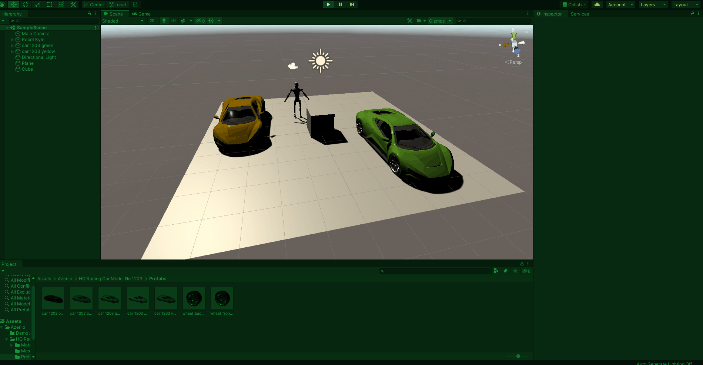

# Práctica FDV Básico #

## Actividades a realizar:

### 1.Incluye GameObjects del menú.

### 2.Incluye GameObjects de la Asset Store.

### 3.Incluye algún controlador del paquete de los Standard Assets.
